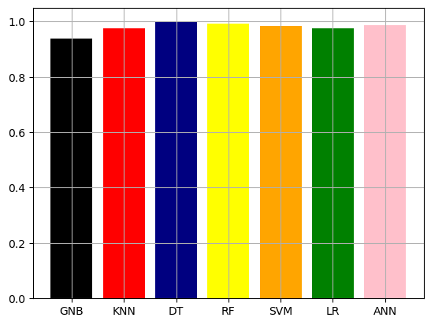
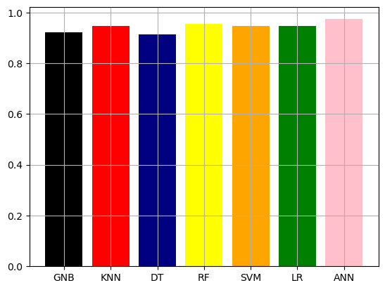
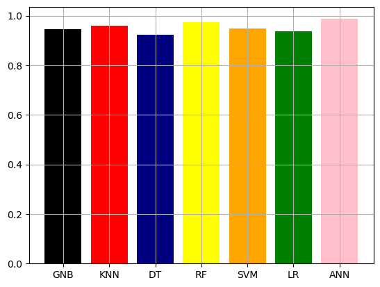
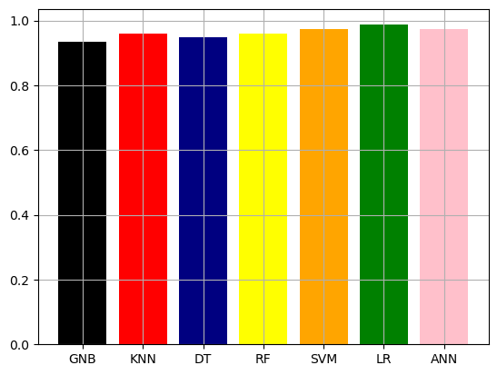

# Breast Cancer Classification Project

## Project Overview
This project aims to classify breast cancer data using several machine learning algorithms. The dataset was obtained from the `sklearn` library, and the goal is to model and compare the performance of different classifiers.

## Dataset
- **Source**: `sklearn.datasets`
- **Test Size**: 20% of the dataset (`test_size=0.2`)

## Algorithms Used
The following algorithms were implemented and evaluated:
- Naive Bayes
- K-Nearest Neighbors (KNN)
- Decision Tree
- Random Forest
- Support Vector Machine (SVM)
- Logistic Regression
- Artificial Neural Network (ANN)

## Evaluation Metrics
The models were evaluated based on the following metrics:
- **Accuracy**: Calculated for both training and test sets.
- **Precision & Recall**: Evaluated on the test set.

## Comparison and Visualization
All algorithms were compared for accuracy, precision, and recall. The results are presented using the following charts:

1. **Accuracy Score for Training Data**
   

2. **Accuracy Score for Test Data**
   

3. **Precision for Test Data**
   

4. **Recall for Test Data**
   

